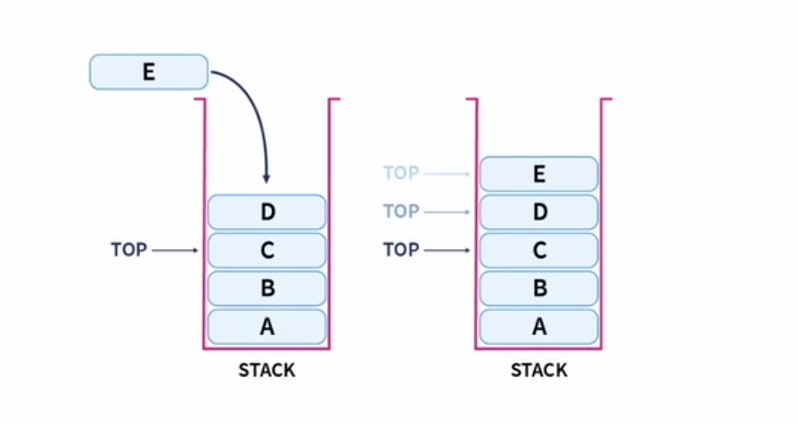
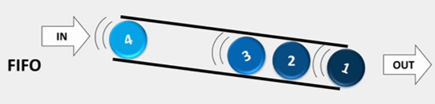
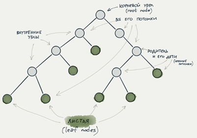
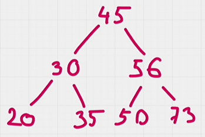
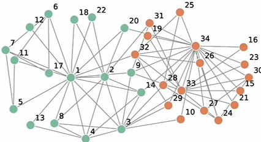

# GRAPHS
# OD02_Stacks_and_queues_Trees_and_graphs
 OD02. Стеки и очереди. Деревья и графы

✅ Бинарное дерево — это вид дерева, 
в котором каждый узел имеет не более двух потомков.

# бинарное дерево

 бинарного дерева поиска. У этой структуры есть свой специфика.

Представим, что мы создаем корневой узел с числом 45.

Помня, что у бинарного дерева не может быть больше двух потомков, создадим два потомка для этого числа: левую и правую ветку. Значение левого потомка всегда меньше родительского узла, а правого — больше.

Таким образом, если мы хотим добавить в дерево значение “30”, оно станет левой ветвью, так как это значение меньше, чем 45.

Если же мы хотим добавить значение “56”, оно будет добавлено в правую ветвь, так как 56 больше, чем 45.

Представим, что теперь мы хотим добавить в дерево значение “20”. Оно меньше, чем 45 и меньше, чем 30. Таким образом, мы отправляем это значение в левую сторону.

Теперь добавим число 35. Оно меньше, чем 45, но больше, чем 30: значит, оно добавится в правую ветку от числа 30.

Таким же образом число 50 встанет левее числа 56.

Число 73 следует разместить справа от числа 56.

✅ Граф — это структура данных, состоящая из множества узлов, то есть вершин, и множества рёбер, которые соединяют пары узлов.
